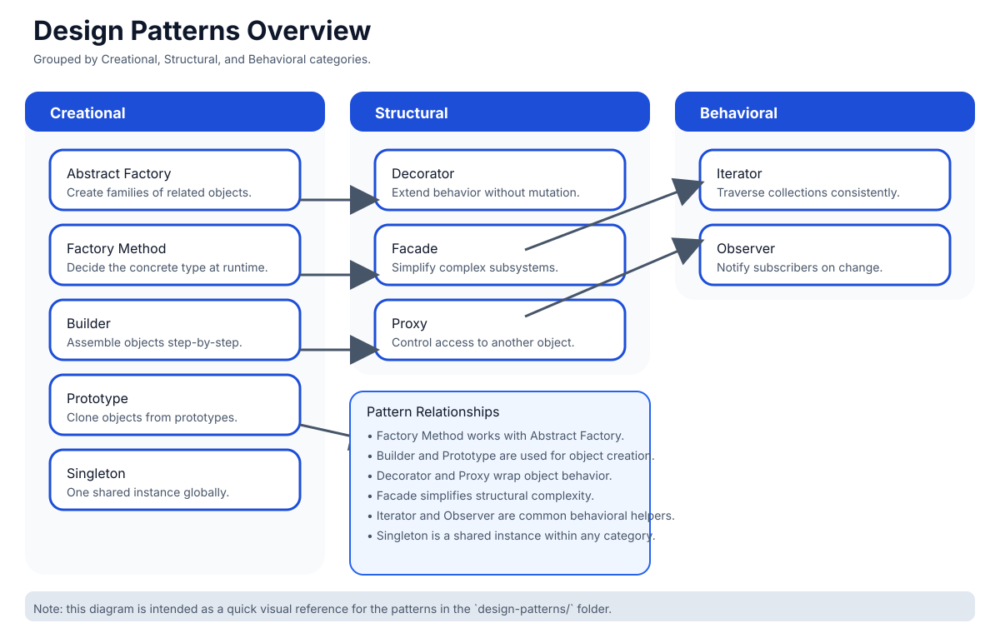

# Design Patterns Visual Summary

A cleaner visual representation of the `design-patterns/` folder, grouped by category.

---

## Pattern groups

- Creational (`creational/`): `abstract-factory.js`, `factory.js`, `builder.js`, `prototype.js`, `singleton.js`
- Structural (`structural/`): `adapter.js`, `decorator.js`, `facade.js`, `proxy.js`
- Behavioral (`behavioral/`): `iterator.js`, `observer.js`

---

## Pattern quick notes

- `creational/abstract-factory.js`: family of related factories.
- `creational/factory.js`: create objects through a dedicated creator.
- `creational/builder.js`: build objects with method chaining.
- `creational/prototype.js`: clone from an existing object.
- `creational/singleton.js`: preserve one shared instance.
- `structural/adapter.js`: make incompatible interfaces work together.
- `structural/decorator.js`: wrap and extend behavior.
- `structural/facade.js`: one interface for many subsystems.
- `structural/proxy.js`: intercept and control object access.
- `behavioral/iterator.js`: traverse collections consistently.
- `behavioral/observer.js`: notify listeners on update.

> Open this file in VS Code Markdown preview to view the improved diagram.

---

## Real-world applied example

For a bigger, applied OOP class-design example that isn't a single named GoF
pattern in isolation, see [`machine-coding/oops/ParkingLot/ParkingLot.js`](../machine-coding/oops/ParkingLot/ParkingLot.js) -
a small parking lot system showing how these class-design instincts (composition,
single-responsibility classes, encapsulated state) come together in one place.
